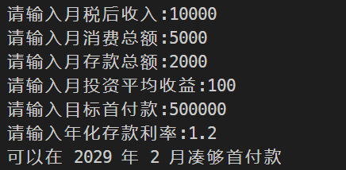
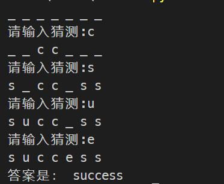
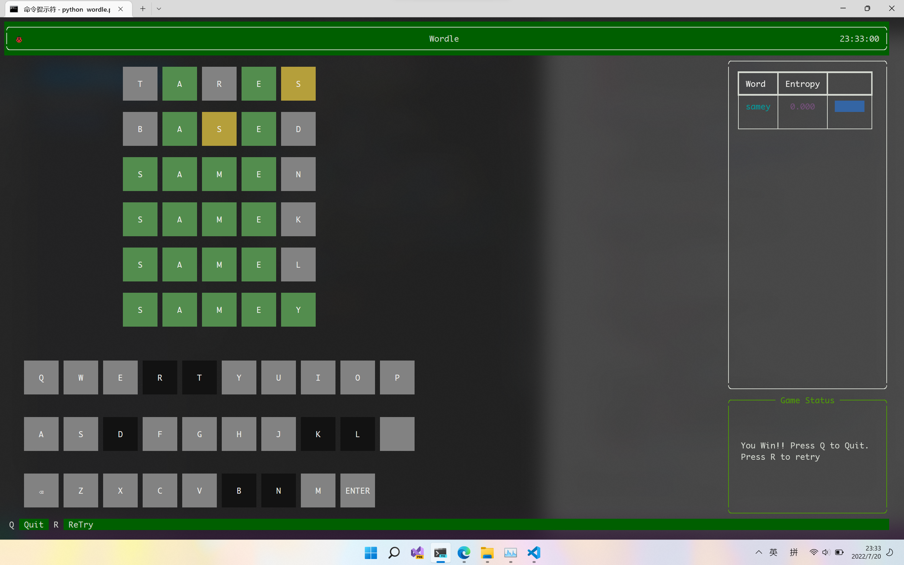

<!--
 * @Descripttion: 
 * @version: 
 * @Author: Mao Shunyu
 * @Date: 2022-07-18 15:56:57
 * @LastEditors: Do not edit
 * @LastEditTime: 2022-07-21 13:00:48
-->
## 第一次作业
###  第一题
``` python
from math import ceil
'''
msg: 计算需要几个月
param {*} a 月税后收入
param {*} b 月消费总额
param {*} c 月存款总额
param {*} d 月投资平均收益
param {*} e 目标首付款
return {*} 需要的时间（月）
'''


def calc(a, b, c, d, e):
    n=0
    sum=0
    ck=0
    while(sum<=e):
        ck+=c
        sum+=a-b+d+ck*f/(12*100)
        n+=1
    return n


while(1):
    try:

        a, b, c, d, e,f = int(input("请输入月税后收入:")), int(input("请输入月消费总额:")), int(
            input("请输入月存款总额:")), int(input("请输入月投资平均收益:")), int(input("请输入目标首付款:"))
        break
    except ValueError as e:
        print("请输入正确的数值！")


month = ceil(calc(a, b, c, d, e))
if month < 0:
    print("凑不够！！")
else:
    year = 2021+month//12
    month = 1+month % 12
    print("可以在", year, "年", month, "月凑够首付款")
```


---------------

### 第二题
```python
# 274926行
import linecache
import random
word = linecache.getline("hangman.txt", random.randint(1, 274926)).strip('\n')
length=len(word)
print('_ '*length)
num = 0
cur=['_' for _ in word]
suc=False
while(num<7):
    if not cur.count('_'):
        suc=True
        break
    guess = input("请输入猜测:")
    if guess in word:
        for i,w in enumerate(word):
            if w==guess:
                cur[i]=guess
        print(' '.join(cur))
        
    else:
        print("没有这个字母")
        num += 1

print("答案是:", word)

if not suc:print("你失败了！")
```


---

## 第二题附加

**使用Textual完成，请先pip install textual numpy *然后全屏***
```python
'''
Descripttion: 
version: 
Author: Mao Shunyu
Date: 2022-07-18 21:31:32
LastEditors: Do not edit
LastEditTime: 2022-07-20 23:23:24
'''
from __future__ import annotations
import json

import linecache
from math import exp, log2
import random
from numpy import linspace
from rich.align import Align
from rich.padding import Padding
from rich.console import RenderableType
from rich.panel import Panel
from rich.table import Table
from rich.bar import Bar
from textual import events
from textual.app import App
from textual.reactive import Reactive
from textual.views import DockView, GridView
from textual.widget import Widget
from textual.widgets import Button, ButtonPressed, Footer, Header


IDLE = "bold white on rgb(130,130,130)"  # 灰色白字
NOT_CLICKABEL_IDLE = "bold on rgb(18,18,18)"  # 黑色
CORRECT = "bold white on rgb(83,141,78)"  # 绿色
PRESENT = "bold white on rgb(181,159,59)"  # 黄色
LETTER_STATUS = [IDLE, NOT_CLICKABEL_IDLE, CORRECT, PRESENT]
LIST = [i.strip('\n') for i in linecache.getlines("hangman5.txt")]


def sigmoid(x):
    return (1/(1+exp(-x)))


fr = open("freq.json", "r")
data: dict[str, int] = json.loads(fr.read())
fr.close()

word_list = data.keys()
freq = data.values()

r = zip(*sorted(zip(word_list, freq), key=lambda x: x[1]))
sorted_word_list, sorted_freq = [list(x) for x in r]

TOTAL = len(word_list)
HX = []

x_width = 10
c = x_width * (-0.5 + 3000 / len(word_list))
xs = linspace(c - x_width / 2, c + x_width / 2, len(word_list))
priors = dict()
for word, x in zip(sorted_word_list, xs):
    priors[word] = sigmoid(x)

for k, v in priors.items():
    priors[k] = priors[k]/sum(priors.values())
HX = [float(i.strip('\n')) for i in linecache.getlines('information.txt')]


def get_pattern(a: str, b: str) -> tuple(str, float):
    outcome = []
    for i, my in enumerate(a):
        if(b[i] == my):
            outcome.append('2')
        elif(my in b):
            outcome.append('3')
        else:
            outcome.append('0')
    return ''.join(outcome),


def check_pattern(pat: str, ans: str, words: list[str], ent: list[float]):
    l = []
    hx = []
    for i, word in enumerate(words):
        ok = True
        for j, s in enumerate(pat):
            if(not ((s == '0' and (ans[j] not in word)) or (s == '2' and (ans[j] == word[j])) or (s == '3' and (ans[j] != word[j]) and (ans[j] in word)))):
                ok = False
                break
        if ok:
            l.append(word)
            hx.append(ent[i])
    return (l, hx)


def sort_a_by_b(a: list, b: list) -> list:
    r = zip(*sorted(zip(a, b), key=lambda x: x[1], reverse=True))
    sorted_a, sorted_b = [list(x) for x in r]
    return sorted_a


def calc_entropy(word_list: list[str]) -> list[float]:

    hx = []
    _priors = {}
    for i in word_list:
        _priors[i] = priors[i]
    s = sum(_priors.values())
    for k, v in _priors.items():
        _priors[k] = _priors[k]/s
    for word in word_list:
        patterns = {}
        for p in word_list:
            pat = get_pattern(word, p)
            if pat in patterns:
                patterns[pat] += _priors[p]
            else:
                patterns[pat] = _priors[p]
        h = 0
        for v in patterns.values():
            h += (-v)*log2(v)
        hx.append(h)

    return hx
#######################################################
# num = 0
# for word in word_list:
#     patterns = {}
#     for p in word_list:
#         pat = get_pattern(word, p)
#         if pat in patterns:
#             patterns[pat] += priors[p]
#         else:
#             patterns[pat] = priors[p]
#     sum = 0
#     for k, v in patterns.items():
#         sum += (-v)*log2(v)
#     hx.append(sum)
#     num += 1
#     if(num % 100 == 0):
#         print(num)
# for i in hx:
#     f.write(str(i)+'\n')


# Console.print(sorted_word_list)
# Console.print(hx)
# f.close()
#################################################


class Letter(Widget):
    label = Reactive("")
    status: Reactive[int] = Reactive(0)

    def __init__(self, name: str, status: int, clickable: bool = False,):
        super().__init__(name)
        self.name = name
        self.label = name
        self.clickable = clickable
        self.status = status
        self.style = LETTER_STATUS[status]

    def render(self) -> RenderableType:
        self.style = LETTER_STATUS[self.status]
        return Button(self.label, style=self.style)

    async def on_click(self, event: events.Click) -> None:
        event.prevent_default().stop()
        if self.clickable:
            await self.emit(ButtonPressed(self))


class ChessBoard(GridView):
    COLUMN_SIZE = 5
    ROW_SIZE = 6

    def __init__(self) -> None:
        super().__init__()
        self.letters = [Letter("", status=1)
                        for _ in range(self.COLUMN_SIZE * self.ROW_SIZE)]
        self.current = 0
        self.have_finished = False

    def on_mount(self, event: events.Mount) -> None:
        self.grid.set_align("center", "center")
        self.grid.set_gap(1, 1)
        self.grid.add_column("column", repeat=self.COLUMN_SIZE, size=7)
        self.grid.add_row("row", size=3, repeat=self.ROW_SIZE)
        self.grid.place(*self.letters)

    def current_guess(self) -> list[Letter]:
        start = self.current // self.COLUMN_SIZE * self.COLUMN_SIZE
        return self.letters[start: start + self.COLUMN_SIZE]

    def current_word(self) -> str:
        return ''.join([i.name for i in self.current_guess()]).lower()

    def input_letter(self, name: str) -> None:
        button = self.letters[self.current]
        if button.name:
            if (self.current % self.COLUMN_SIZE == self.COLUMN_SIZE - 1) and not self.have_finished:
                # 最后一个了
                return
            self.current += 1
            button = self.letters[self.current]
        button.name = name
        button.label = name
        self.have_finished = False

    def backspace_letter(self) -> None:
        button = self.letters[self.current]
        if not button.name:
            if self.current % self.COLUMN_SIZE == 0:
                # 第一个
                return
            self.current -= 1
            button = self.letters[self.current]
        button.name = button.label = ""

    def check_solution(self, answer: str) -> list[int]:
        outcome = []
        for i, my in enumerate(self.current_word()):
            if(answer[i] == my):
                outcome.append(2)
                continue
            elif(my in answer):
                outcome.append(3)
            else:
                outcome.append(0)
        return outcome


class KeyBoard(GridView):
    KEYBOARD = "QWERTYUIOPASDFGHJKLZXCVBNM"

    def __init__(
        self, name: str = None
    ) -> None:
        super().__init__(name=name)
        self.letters = [Letter(i, 0, clickable=True) for i in self.KEYBOARD]
        back = Letter("backspace", 0, clickable=True)
        enter = Letter("enter", 0, clickable=True)
        back.label = "⌫"
        enter.label = "ENTER"
        self.letters.append(enter)
        self.letters.insert(19, Letter('', status=0))
        self.letters.insert(20, back)

    async def on_mount(self) -> None:
        self.grid.set_align("center", "center")
        self.grid.set_gap(1, 2)
        self.grid.add_column("column", repeat=10, size=7)
        self.grid.add_row("row", size=3, repeat=3)
        self.grid.place(*self.letters)


class Data(Widget):
    words = Reactive([])
    ent = Reactive([])

    def __init__(self, words: list[str], ent: list[float], name: str = None) -> None:
        super().__init__(name)
        self.words = words
        self.ent = ent

    def render(self) -> RenderableType:
        table = Table()
        table.add_column("Word", style="cyan", justify="center")
        table.add_column("Entropy", style="magenta", justify="center")
        table.add_column("",style='blue',justify="left")
        size=5
        m=max(self.ent)
        for i, word in enumerate(self.words):
            end=self.ent[i]/m*size if m!=0 else size
            table.add_row(word, '%.3f' % self.ent[i],Padding(Bar(size=size,begin=0,end=end,color="blue",width=6),(0,0,1,0)))
        return Panel(table)


class GameStat(Widget):
    label = Reactive("")

    def render(self) -> RenderableType:
        self.content = Panel(Align.center(self.label, vertical="middle"),
                             title="Game Status", title_align="center", border_style="green")
        return self.content


class wordleApp(App):
    word_list = LIST[:]
    entropy = HX[:]

    def action_retry(self):
        self.answer = LIST[random.randint(0, len(LIST)-1)]
        self.word_list = LIST[:]
        self.entropy = HX[:]
        self.data.words = sort_a_by_b(self.word_list, self.entropy)[:20]
        self.data.ent = sorted(self.entropy, reverse=True)[:20]
        self.gs.label = ""
        self.gs.style = None
        self.cb.current = 0
        for i in self.cb.letters:
            i.name=i.label=''
            i.clickable=False
            i.status=1
        for i in self.kb.letters:
            i.status=0
        self.cb.have_finished = False


    async def on_mount(self):
        await self.bind("q", "quit", "Quit")
        await self.bind("r", "retry", "ReTry")
        self.answer = LIST[random.randint(0, len(LIST)-1)]
        self.left = DockView()
        self.right = DockView()
        self.cb = ChessBoard()
        self.kb = KeyBoard()
        self.data = Data(sort_a_by_b(self.word_list, self.entropy)[
                         :20], sorted(self.entropy, reverse=True)[:20])
        self.gs = GameStat()
        header = Header()
        footer = Footer()
        await self.left.dock(self.cb, size=26)
        await self.left.dock(self.kb, size=20)

        await self.right.dock(self.data, edge="top", size=30)
        await self.right.dock(self.gs, edge="top", size=15)
        await self.view.dock(header, edge="top")
        await self.view.dock(footer, edge="bottom")
        await self.view.dock(self.right, edge="right", size=33)
        await self.view.dock(self.left, edge="left", size=87)

    def handle_button_pressed(self, message: ButtonPressed) -> None:
        if message.sender.name == "enter":
            if self.check_input():
                self.gs.label = "You Win!! Press Q to Quit.\nPress R to retry"
                self.gs.content.style = "bold red on grey"
        elif message.sender.name == "backspace":
            self.cb.backspace_letter()
        else:
            self.cb.input_letter(message.sender.name)

    def check_input(self) -> bool:
        current = self.cb.current_guess()  # list[letter]
        current_word = self.cb.current_word()  # str
        if len(current_word) != 5:
            # Animation TODO
            return
        if current_word not in LIST:
            # Animation TODO
            return
        outcome = self.cb.check_solution(self.answer)
        for i, value in enumerate(current):
            value.status = outcome[i]
            if outcome[i] == 0:
                for l in self.kb.letters:
                    if(l.name == value.name):
                        l.status = 1
        self.cb.have_finished = True
        self.word_list, self.entropy = check_pattern(
            ''.join([str(i) for i in outcome]), current_word, self.word_list, self.entropy)
        self.entropy = calc_entropy(self.word_list)
        self.data.words = sort_a_by_b(self.word_list, self.entropy)[:20]
        self.data.ent = sorted(self.entropy, reverse=True)[:20]
        if(outcome == [2, 2, 2, 2, 2]):
            return True


wordleApp.run(title="Wordle")

```
