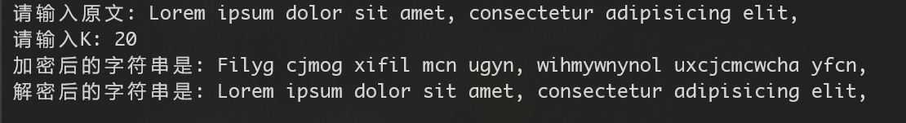

<!--
 * @Descripttion: 
 * @version: 
 * @Author: Mao Shunyu
 * @Date: 2022-07-23 15:05:02
 * @LastEditors: Do not edit
 * @LastEditTime: 2022-07-23 15:05:51
-->
## 第三次作业
### 第一题
```python
class Caesar_cipher:

    def __init__(self, string: str, mode: int) -> None:
        if mode == 1:
            self.original = string  # 加密
        elif mode == 0:
            self.enciphered = string  # 解密

    def encipher(self, k: int) -> str:
        self.enciphered = ''.join([(chr((ord(i)+k)-((ord(i)+k-90) > 0)*26)) if (65 <= ord(i) <= 90) else (
            (chr((ord(i)+k)-((ord(i)+k-122) > 0)*26)) if (97 <= ord(i) <= 122) else i) for i in self.original])
        return self.enciphered

    def decipher(self, k: int) -> str:
        self.original = ''.join([(chr((ord(i)-k)+((ord(i)-k-65) < 0)*26)) if (65 <= ord(i) <= 90) else (
            (chr((ord(i)-k)+((ord(i)-k-97) < 0)*26)) if (97 <= ord(i) <= 122) else i) for i in self.enciphered])
        return self.original


ori = input("请输入原文: ")
k = int(input("请输入K: "))
cc = Caesar_cipher(ori, 1)
print("加密后的字符串是:", cc.encipher(k))
print("解密后的字符串是:", cc.decipher(k))

```
